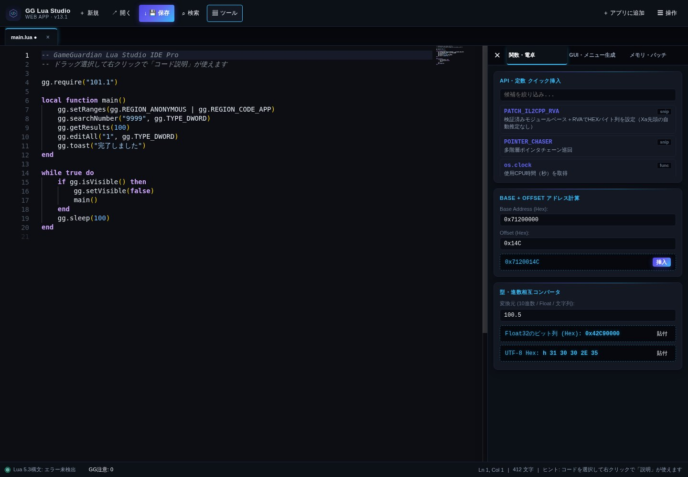

# GG Lua Studio

**書く。確かめる。ひとつのLuaに。**
GameGuardian向けLuaスクリプトを、PC・タブレットのブラウザーで開発するWebエディターです。

[**エディターを開く →**](https://nyankohack.tokyo/Lua_editor.html) · [公式案内ページ](https://nyankohack.tokyo/) · [利用条件](LICENSE)

**v13.1 · PC / Touch · 日本語 / English / Русский / 中文**

> **重要：ホーム画面への追加と、コードの保存は別です。**
> ソースの自動保存・自動バックアップはありません。終了・更新・再読み込みの前にLuaファイルとして保存してください。



## 目次

- [まずは3ステップ](#まずは3ステップ)
- [できること](#できること)
- [PCとタブレットの使い分け](#pcとタブレットの使い分け)
- [保存形式を選ぶ](#保存形式を選ぶ)
- [ホーム画面・アプリ一覧へ追加](#ホーム画面アプリ一覧へ追加)
- [よくある問題](#よくある問題)
- [通信・データ・保護の制約](#通信データ保護の制約)
- [検証範囲](#検証範囲)
- [ファイル構成と更新](#ファイル構成と更新)
- [利用条件](#利用条件)

## まずは3ステップ

1. **開く** — [エディター](https://nyankohack.tokyo/Lua_editor.html)で新規タブを作成するか、端末内のUTF-8 Luaファイルを開きます。アカウント登録は不要です。
2. **書いて確認する** — コードを編集し、下部の構文診断・GG注意を確認します。入力しづらい場合は「操作」または下部バーから「タッチ入力」を切り替えてください。
3. **元のLuaを保存する** — 「保存」でまず通常の`.lua`を残します。その後、必要に応じて軽量化・保護付き形式も出力します。

実際のスクリプト実行は、対応するGameGuardian環境で確認してください。このWebサイトはゲームメモリーに接続せず、iPadにGameGuardianの実行環境を追加するものでもありません。

## できること

| 機能 | 内容 |
|---|---|
| コード表示・補完 | Monaco Editorによる色分け、GG APIの候補、引数ヒント |
| タッチ入力 | OS標準テキスト欄を使い、通常表示と同じ編集モデルへ同期 |
| リアルタイム診断 | Lua構文エラーとGG APIの静的な注意事項を表示 |
| END修復 | 現在のソースから不足ENDの挿入候補を探索し、確認後に適用 |
| 選択コードの説明 | 元のソース行番号に対応した説明を表示 |
| コード生成 | メニュー、ダイアログ、構造体テーブル、RVAパッチの作成補助 |
| 計算・変換 | Base＋Offset、DWORD、Float、UTF-8 HEX |
| 出力 | 生Lua、軽量化、認証付き自己復号、期限付き出力 |

**診断はGG実行環境の完全な再現ではありません。** END修復は過去のコードを復元する機能ではなく、複数候補や不完全な探索を「唯一の正解」と断定しません。RVAパッチには利用者が検証した基準アドレスが必要で、ライブラリやXa領域の自動特定は行いません。

## PCとタブレットの使い分け

### 通常のコード表示

マウス中心のPCでは通常表示から開始します。色分けや補完ポップアップを使う編集に適しています。

### タッチ入力

タッチ優先端末では、画面幅にかかわらず標準テキスト欄で開始します。

- 日本語入力・範囲選択にOS標準の入力欄を使用。
- 保存、構文診断、GG注意、Undo/Redoは通常表示と共通。
- 通常の改行で直前行の空白・タブを引き継ぐ。ENDは勝手に追加しません。
- タブごとの選択範囲・スクロール位置をメモリー上で保持。終了後の復元ではありません。
- 色分けや補完ポップアップが必要な場合は、通常表示へ切り替えます。「候補」でも切り替えられます。

狭い画面では「ツール」でパネルを開閉できます。高さが小さくなった画面では検索パネルの高さを制限し、一部の操作列を一時的に畳んで編集領域を確保します。

文字サイズ・折り返し・テーマは「操作」メニューで変更できます。案内ページの言語選択もエディターと共通の表示設定を使います。

### PC・外付けキーボード

| 操作 | ショートカット |
|---|---|
| 保存・エクスポート | `Ctrl / ⌘ + S` |
| 検索／置換 | `Ctrl / ⌘ + F` / `H` |
| ファイルを開く | `Ctrl / ⌘ + O` |
| 新規タブ | `Ctrl / ⌘ + Alt + N` |
| ツール開閉 | `Ctrl / ⌘ + Alt + T` |
| 整形 | `Shift + Alt + F` |
| 補助パネルを閉じる | `Esc` |

OS・ブラウザーの予約キーには環境差があります。画面上のボタンも利用してください。

## 保存形式を選ぶ

| 拡張子 | 主な用途 | 注意点 |
|---|---|---|
| `.lua` | 編集継続・元のソースの保管 | **まずこの形式を残すことを推奨** |
| `.min.lua` | コメント・空白等を削減した出力 | 読みやすい原本を別に保存 |
| `.enc.lua` | 認証付き自己復号形式 | コピー・動的解析を完全には防げない |
| `.timed.lua` | 期限情報を含む認証付き出力 | 判定は実行端末の時計に依存 |

保護付き出力はAES-256-CTR / HMAC-SHA-256、必須の鍵復元VM、対応部分だけを対象とする保守的な部分VMを使用します。生成Luaは引き続き **完全オフライン・入力なし・単一ファイル** の方式です。

## ホーム画面・アプリ一覧へ追加

[エディター](https://nyankohack.tokyo/Lua_editor.html)を、埋め込みフレームではなく通常のブラウザータブで開いてください。公開されたHTTPS URLが必要です。

| 端末 | 操作 |
|---|---|
| iPad / iPhone | Safari → 共有 →「ホーム画面に追加」。表示される場合は「Webアプリとして開く」を有効にする |
| Android | Chrome → メニュー →「アプリをインストール」または「ホーム画面に追加」 |
| PC | Chrome / Edgeのアドレスバーのインストールアイコン、またはブラウザーメニュー |
| Mac Safari | 対応版では「ファイル → Dockに追加」 |

メニュー名や対応状況はブラウザーにより異なります。アプリ内の「アプリに追加」にも手順があります。起動先は案内ページではなく`Lua_editor.html`です。APKではありません。

## よくある問題

| 状況 | 確認すること |
|---|---|
| エディターの読み込みが終わらない | ネット接続、CDNへのアクセス、拡張機能や配信元の制限を確認。未保存コードがある場合は再読み込み前に退避 |
| インストール案内が出ない | HTTPS・通常タブ・対応ブラウザーで開いているか確認。iPad Safariでは共有メニューから追加 |
| 日本語入力や選択がしづらい | 「タッチ入力」を試す。色分け／補完を使いたいときは通常表示へ戻す |
| キーボード表示で操作列が消えた | 低い画面向けに一時的に畳まれています。キーボードを閉じる、検索を閉じる、または表示領域を広げる |
| 再起動後にコードが見つからない | ソースの自動復旧機能はありません。保存したLuaファイルを開く |
| 更新が見えない | 先にコードを保存し、アプリを閉じて開き直す。必要なら通常ブラウザーで再読み込み |
| 保存先や共有画面が説明と違う | OS・ブラウザーによって保存方法や権限ダイアログが異なります |

## 通信・データ・保護の制約

### エディターの起動とデータ

- エディターはMonacoをCDNから読み込むため、**起動はオンライン前提**です。オフライン起動用のアプリキャッシュはありません。
- ソースの自動保存・クラウドバックアップはありません。OSの強制終了・再読み込み後の復旧も保証しません。
- ブラウザーには言語などの表示設定を保存します。ソースをlocalStorageやCache Storageへ自動保存する機能はありません。
- Webエディターの通信要件と、生成Luaがオフラインで動作することは別です。

### 保護で保証しないこと

- 自己復号に必要な情報もLua内に含まれるため、鍵や復号済みコードの抽出を完全には防げません。
- HMACは、ローダー全体の差し替えや、鍵を取得した利用者による再署名を防ぐものではありません。
- 期限判定は外部の信頼できる時刻認証ではなく、端末時計に依存します。
- 公開HTML／JavaScriptの圧縮・難読化も、読解の手間を増やす処理です。秘匿やコピー防止を保証しません。
- 過去に公開したソースはGitの履歴等に残り、難読化したファイルで上書きしても回収できません。

## 検証範囲

ChromiumとWebKitで、画面サイズ、4言語、入力、保存、診断、END修復、難読化後の動作を自動検証しています。WebKitはiPadOS Safari自体ではなく、Android設定のChromiumも実機ではありません。

OSの日本語IME、長押し・選択ハンドル、ホーム画面からの起動、フローティングキーボード、iOS Files／Android共有画面、低メモリー時の復帰は実機確認が必要です。高速再読み込み時にWebKitで一時的な`Load failed`ログが記録された試験もあり、全環境で無エラーとは判断していません。

Web側の確認は、新たなGameGuardian実機実行や、実機での起動時間保証ではありません。

## ファイル構成と更新

```text
index.html                              案内ページ
Lua_editor.html                         v13.1エディター本体
README.md                               この説明
GG_script_editor_site_screenshot_1.jpg  実際の編集画面
manifest.webmanifest                    アプリ情報・起動先
sw.js                                   ネットワーク取得用Service Worker
icons/                                  アプリ用PNGアイコン
CNAME                                   独自ドメイン設定
LICENSE                                 利用条件
THIRD_PARTY_NOTICES.md                   第三者ソフトウェアの表示
.nojekyll / _headers                     配信補助設定
```

ビルドサーバーや独自のAPIサーバーを必要としない静的サイトです。`index.html`と`Lua_editor.html`の役割を維持し、PWA用ファイルも同じ階層で配信します。

公開版HTMLには選択済みの追加難読化を適用しています。変更は難読化前の保守用原本で行い、動作確認した公開版を生成してください。公開リポジトリーには原本・ソースマップ・非公開検証フィクスチャを混ぜない構成です。

更新時は編集中のコードを保存してから同じ公開先へ一式を配置し、アプリを開き直します。`CNAME`やmanifestのIDを不用意に変更しないでください。

## 利用条件

Copyright © 2026 Hibiki Kato. All rights reserved.

個人の学習・開発目的での利用を対象としています。再配布・転載・ミラーリング・再ホスティング・販売・商用利用に関する制限は、既存の[LICENSE](LICENSE)を参照してください。閲覧できることは再配布等の許可を意味しません。

Monaco Editor、luaparse等の第三者ソフトウェアにはそれぞれのライセンスが適用されます。[第三者ライセンス表示](THIRD_PARTY_NOTICES.md)も参照してください。本サイトはGameGuardian公式サイトではなく、独立した開発ツールです。

---

### English summary

GG Lua Studio is a browser workspace for GameGuardian Lua development, with code completion, live diagnostics, native touch input, generators, and protected export. **Online access is required to start the editor. Installing the web app does not save your source.** Save an editable `.lua` file before closing or updating. Exported self-decrypting Lua remains offline, input-free, and single-file, but copying and key extraction cannot be made impossible. Real-device IME, installation, and OS file-dialog verification remain necessary. Personal-use restrictions and third-party licenses apply.
